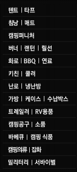
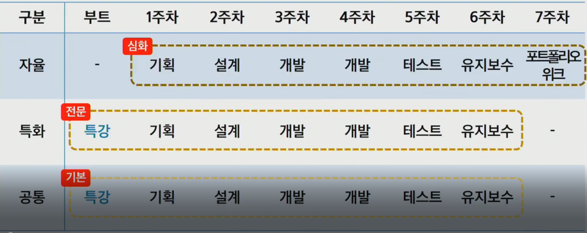

# 220111 회의

Created: 2022년 1월 11일 오전 9:59
Last Edited Time: 2022년 1월 11일 오후 3:05

# 아이디어 구체화

1. 메이트 기능
    1. 메이트 모집
        1. 개인이 모집을 한다(장소 및 일정 게시)
        2. 원하는 캠핑 테마별 모임
    2. 메이트 매칭
        1. 회원가입 시, 선택한 선호유형(1단계) 일치갯수에 따라 비슷한 회원 추천
        2. 매칭시 친구 추가, 메세지 또는 쪽지 기능
        3. 후기 작성시 동행자 평가 또는 태그 → 신뢰성 증가 효과
        
        
    
2. SNS (인스타 형식)
    1. 사람 검색 결과, 매칭 검색과 유사하게
    2. 캠핑에 관한 글 작성, 수정, 삭제
    3. 댓글 기능, 좋아요 기능, 신고 기능
    4. 팔로우 기능
    5. 후기 작성시 동행자 평가 또는 태그 → 신뢰성 증가 효과
    

c. 회원관리

1. 회원 가입
    1. 아이디, 비밀번호, 이메일, 
    프로필 이미지, 
    본인 장비(차량포함), 
    거주 지역,  
    캠핑 스타일 (eg. 산 or 바다 선호, 활동적 or 비활동적 등) - 1단계(간단한 수준의 캠핑 선호 스타일을 체크한다.
    2. 소셜 회원가입(최소 1개, 2~3개 가능 시 추가) , 기본적으로 카카오 로그인)
    3. 이용약관
    

2.로그인

1. 소셜 로그인 (최소 1개, 2~3개 가능 시 추가) , 기본적으로 카카오 로그인
2. 이메일 및 비밀번호를 찾을 수 있다.

3. 마이페이지

1. 회원 정보 수정
2. 프로필 사진 등록
3. 회원 탈퇴
4. 자신의 게시물 확인
5. 캠핑장 리스트 담기(좋아요)
6. 자신의 장비 리스트 올리기(다른 사용자 확인 가능)
   
    텐트. 타프, 의자, 테이블,
    
    
    
1. 캠핑장 기본정보 제공
    1. 데이터 이용
    

# 필요 추가 조사

1. 캠핑 혼자라서 못간 경우 있는지 여부 조사
2. 처음 보는 사람과 함께 가고 싶다면 어떤 사람이었으면 좋겠는지?

## 이번주까지 해야할 일

1. 와이어 프레임 제작
2. 요구사항 정의서

