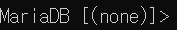

## 스켈레톤 코드 실행
- 명세서대로 환경설정 해주기 (환경 변수 설정 해줘야 함)

### DB 접속
- ID : root / Password : ssafy
- Docker 명령어 ```docker exec -it maria-db mysql -u root -p```
-  : Database가 선택되지 않은 상태
- ```show databases;```로 Database를 확인한 후 ```use ssafy;```로 Database 사용
- 그 외 문법은 MySQL과 거의 동일하다.

### 소스 코드 실행
- 로그인 : postman 설치 후 ```http://localhost:8080/account/login``` 접속

## 주의할 점
- Java 환경 변수 설정을 해주지 않아도 될 줄 알았는데 안해주니 오류가 났다.